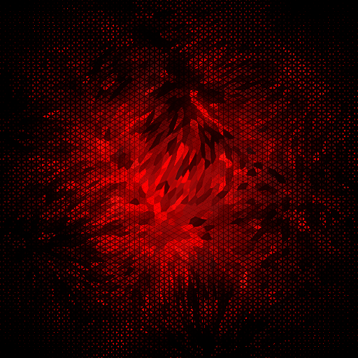

<p align="center">
  
</p>

Coming soon...

## 💾 Installation

Install in Foundry VTT via manifest:  
`https://raw.githubusercontent.com/mdf-irl/crispy-critters/master/module.json`

---

## 🎲 Texture Previews (hover for name, click to enlarge)
<p align="center">
  <a href="textures/vampira.webp"></a>
  <a href="textures/vampira.webp"></a>
  <a href="textures/vampira.webp"></a>
  <a href="textures/vampira.webp"></a>
  <a href="textures/vampira.webp"></a>
  <a href="textures/vampira.webp"></a>
  <a href="textures/vampira.webp"></a>
  <a href="textures/vampira.webp"></a>
  <a href="textures/vampira.webp"></a>
  <a href="textures/vampira.webp"></a>
  <a href="textures/vampira.webp"></a>
  <a href="textures/vampira.webp"></a>
  <a href="textures/vampira.webp"></a>
  <a href="textures/vampira.webp"></a>
  <a href="textures/vampira.webp"></a>
  <a href="textures/vampira.webp"></a>
  <a href="textures/vampira.webp"></a>
  <a href="textures/vampira.webp"></a>
</p>

---

## 📜 Licensing

This project uses multiple licenses:

- **Code:** MIT License (see LICENSE)
- **Textures / Image Assets:** CC BY-NC-SA 4.0 (see LICENSE-TEXTURES)
- **Fonts:** SIL Open Font License 1.1 (see LICENSE-FONTS and individual font folders)

### Important Notes
- Commercial use of textures is **not permitted**
- Use of textures **must be appropriately credited**
- Fonts may have additional requirements (see individual OFL.txt files)

---

## 📎 Attribution

### Fonts
* [New Rocker](https://fonts.google.com/specimen/New+Rocker) (`new-rocker-v17-latin-regular.woff2`):
```
Copyright (c) 2012, Pablo Impallari (www.impallari.com|impallari@gmail.com),  
Copyright (c) 2012, Brenda Gallo (gbrenda1987@gmail.com),  
Copyright (c) 2012, Rodrigo Fuenzalida (www.rfuenzalida.com|hello@rfuenzalida.com),  
with Reserved Font Name 'New Rocker',
Licensed under SIL Open Font License, Version 1.1 (OFL-1.1) (https://openfontlicense.org/)
```
### Textures
```
Copyright (c) 2026 mdf (https://github.com/mdf-irl)
Textures from Crispy Critters (https://github.com/mdf-irl/crispy-critters)
Licensed under CC BY-NC-SA 4.0 (https://creativecommons.org/licenses/by-nc-sa/4.0/)
```
