<p align="center">
  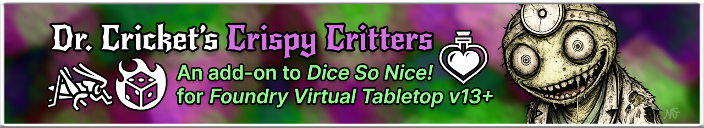
</p>

**Dr. Cricket's Crispy Critters** is a module for [Foundry Virtual Tabletop](https://foundryvtt.com/) that functions as an add-on to the popular [Dice So Nice!](https://gitlab.com/riccisi/foundryvtt-dice-so-nice) module, adding 70+ new dice sets and customization options for your 3D dice rolling pleasure.


## 💾 Installation
Install in Foundry VTT via manifest:  
`https://raw.githubusercontent.com/mdf-irl/crispy-critters/master/module.json`

---

## 🎲 Dice Gallery (click to enlarge)
<p align="center">
  <a href="images/as-black-hole.webp"></a>
  <a href="images/as-cataclysm.webp"></a>
  <a href="images/as-cosmic-chaos.webp"></a>
  <a href="images/as-ember.webp"></a>
  <a href="images/as-moon.webp"></a>
  <a href="images/as-nebula.webp"></a>
  <a href="images/as-radiance.webp"></a>
  <a href="images/as-solaris.webp"></a>
  <a href="images/as-space-oddity.webp"></a>
  <a href="images/as-tempest.webp"></a>
  <a href="images/as-tide.webp"></a>
  <a href="images/cs-candy-hearts.webp"></a>
  <a href="images/cs-cotton-candy.webp"></a>
  <a href="images/cs-mint-chocolate-chip.webp"></a>
  <a href="images/cs-saltwater-taffy.webp"></a>
  <a href="images/cs-sweets.webp"></a>
  <a href="images/cs-waffles.webp"></a>
  <a href="images/crs-amethyst.webp">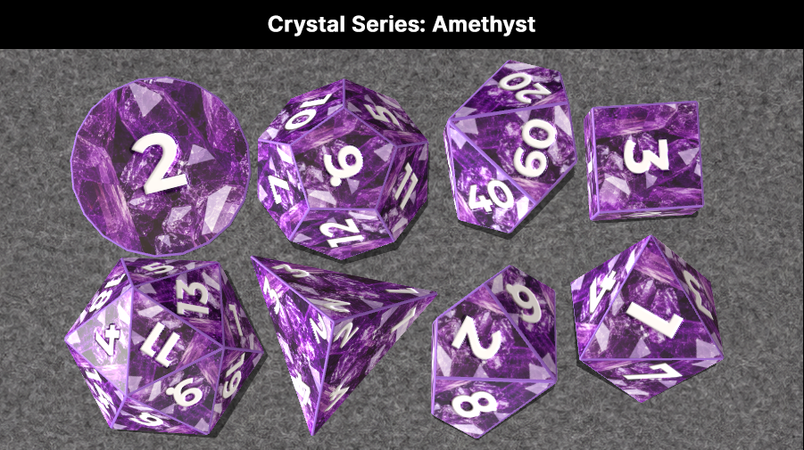</a>
  <a href="images/crs-diamond.webp">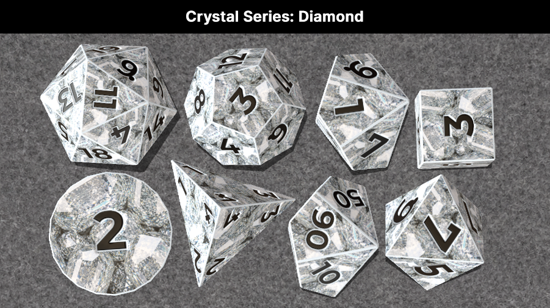</a>
  <a href="images/crs-emerald.webp">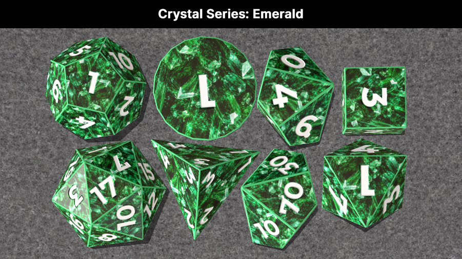</a>
  <a href="images/crs-ruby.webp">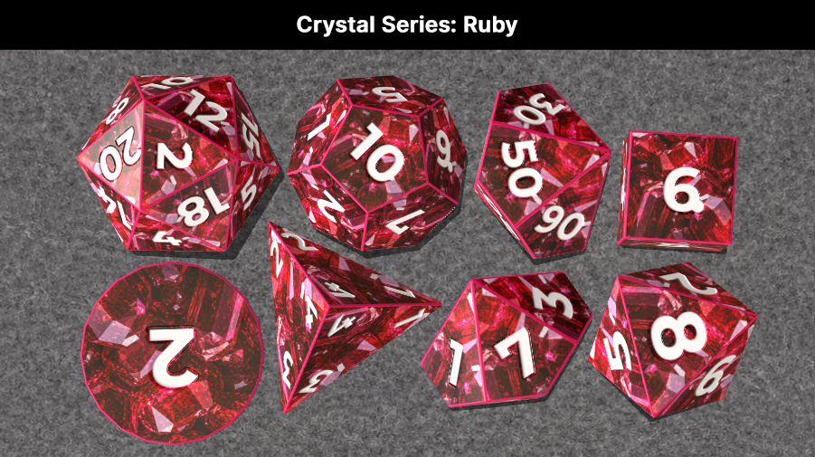</a>
  <a href="images/crs-sapphire.webp">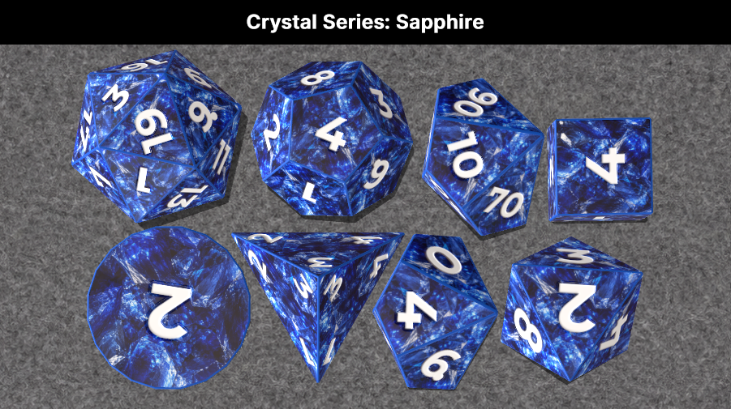</a>
  <a href="images/crs-topaz.webp">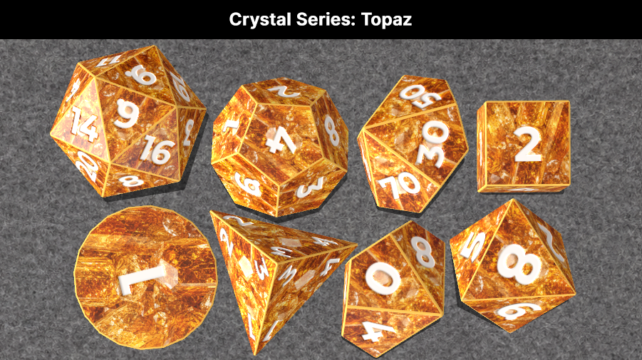</a>
  <a href="images/mms-blazewave.webp">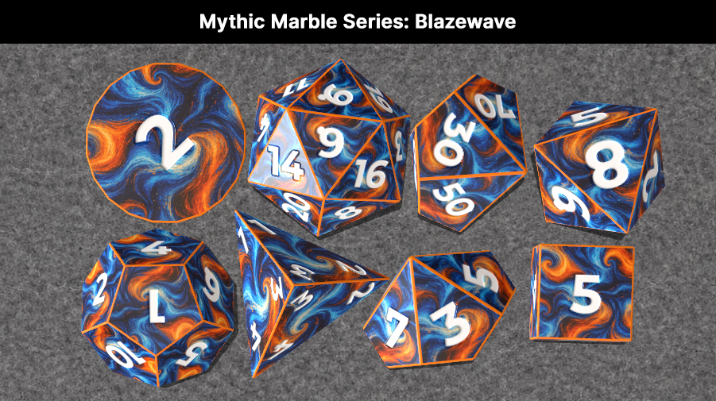</a>
  <a href="images/mms-dreamweaver.webp">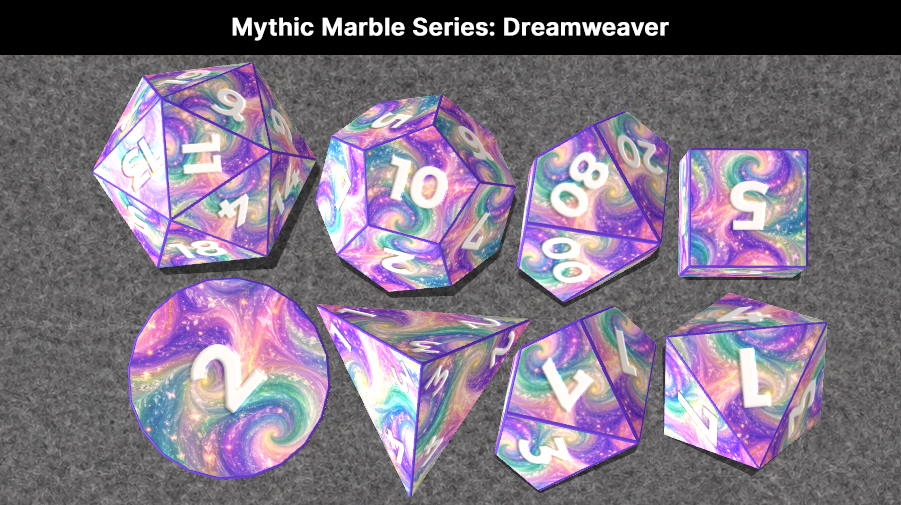</a>
  <a href="images/mms-enchanted-forest.webp">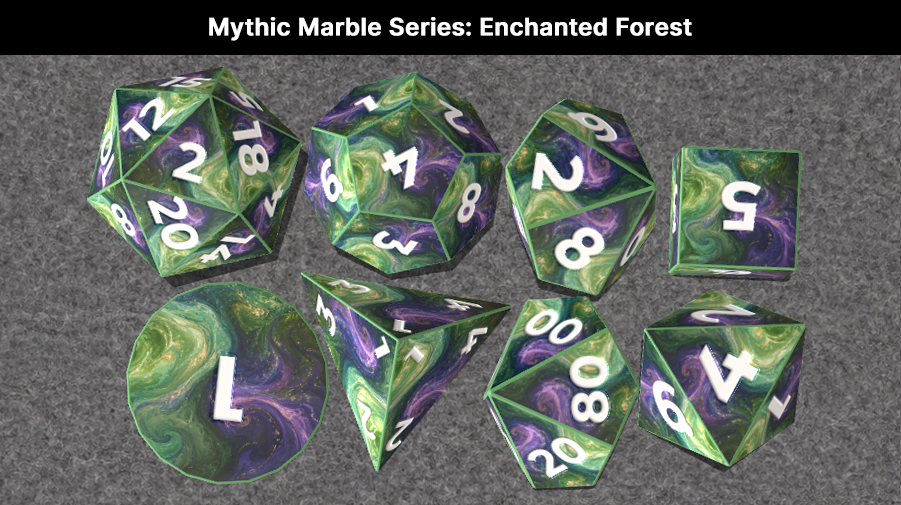</a>
  <a href="images/mms-funhouse-fever.webp">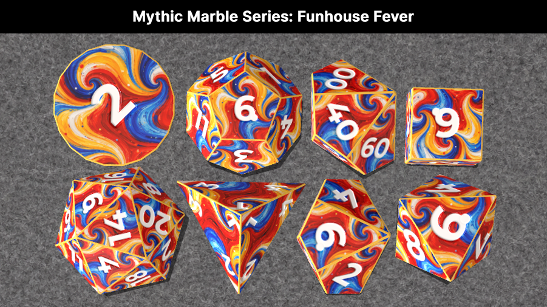</a>
  <a href="images/mms-funkalicious.webp">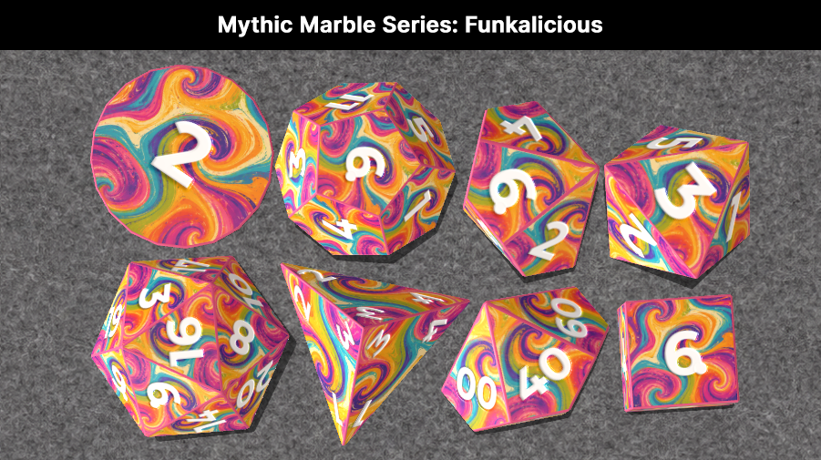</a>
  <a href="images/mms-necrosis.webp">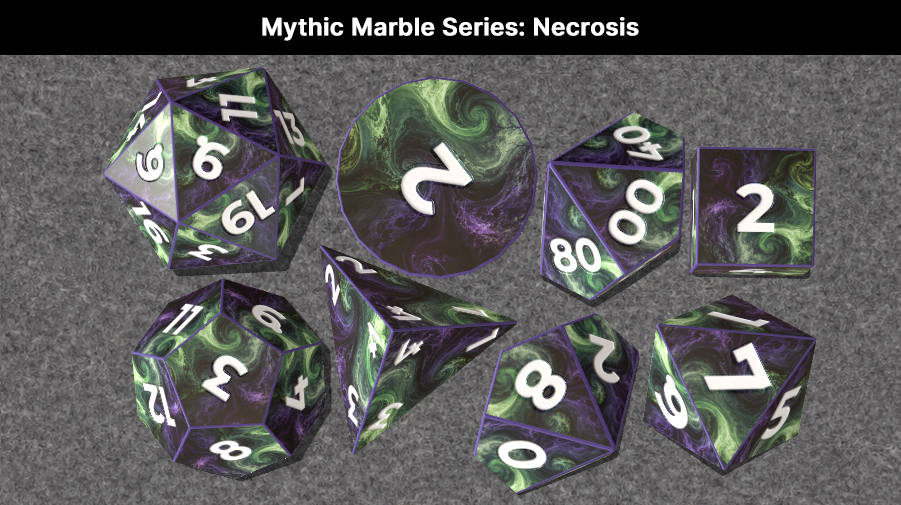</a>
  <a href="images/mms-nefarious-knight.webp">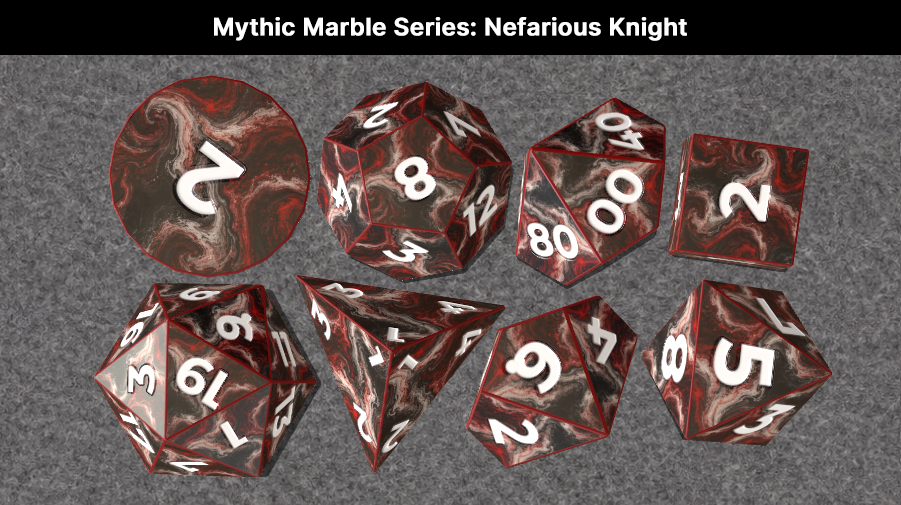</a>
  <a href="images/mms-neptunes-wake.webp">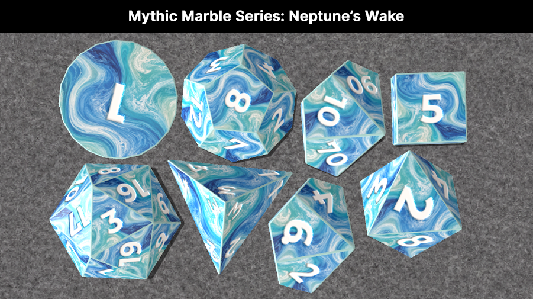</a>
  <a href="images/mms-phoenix.webp">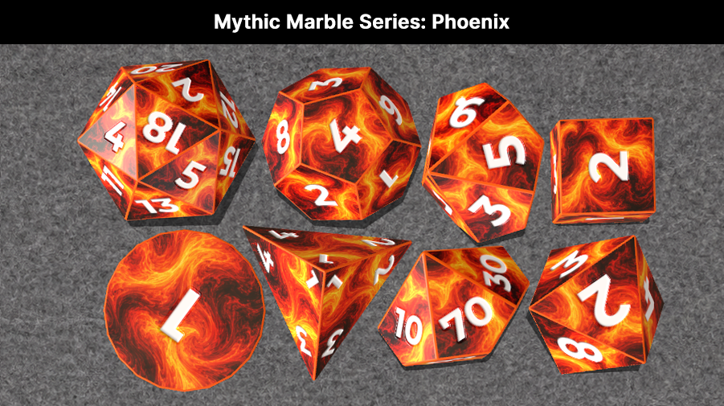</a>
  <a href="images/mms-skybreaker.webp">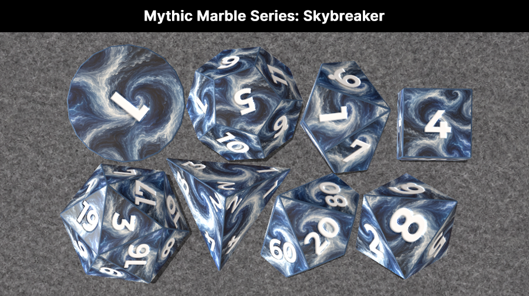</a>
  <a href="images/mms-toxic-twirls.webp">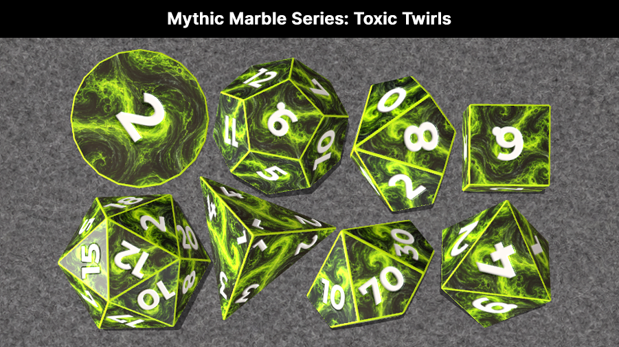</a>
  <a href="images/os-ice.webp"></a>
  <a href="images/os-magma.webp"></a>
  <a href="images/os-ooze.webp"></a>
  <a href="images/ps-pixie-blue.webp"></a>
  <a href="images/ps-pixie-pink.webp"></a> 
  <a href="images/ss-barbarian.webp"></a>
  <a href="images/ss-bard.webp"></a>
  <a href="images/ss-cleric.webp"></a>
  <a href="images/ss-druid.webp"></a>
  <a href="images/ss-fighter.webp"></a>
  <a href="images/ss-monk.webp"></a>
  <a href="images/ss-paladin.webp"></a>
  <a href="images/ss-ranger.webp"></a>
  <a href="images/ss-rogue.webp"></a>
  <a href="images/ss-sorcerer.webp"></a>
  <a href="images/ss-warlock.webp"></a>
  <a href="images/ss-wizard.webp"></a>
  <a href="images/sps-abyssal-grave.webp"></a>
  <a href="images/sps-bones.webp">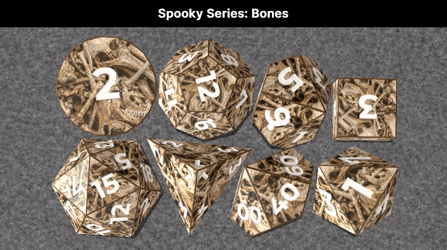</a>
  <a href="images/sps-wall-of-eyes.webp">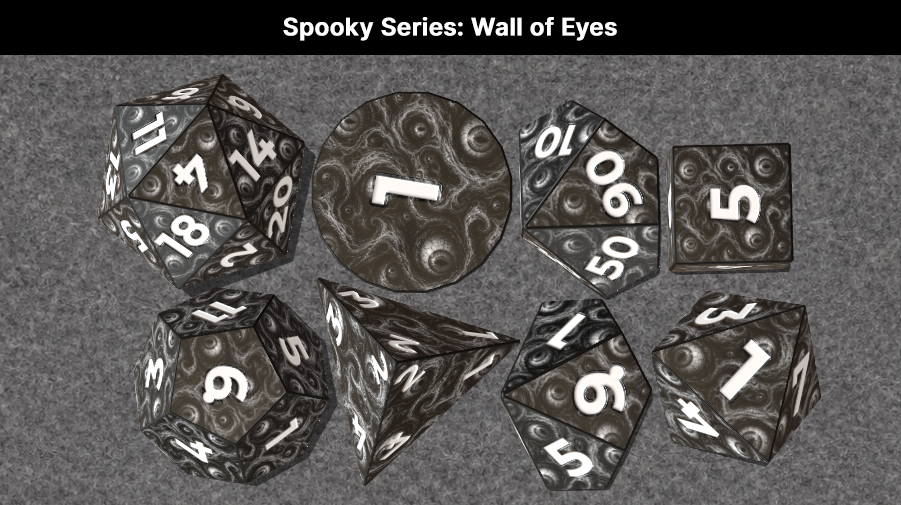</a>
  <a href="images/sps-dexters-delight.webp"></a>
  <a href="images/sps-eldritch-night.webp"></a>
  <a href="images/sps-god-damaged.webp"></a>
  <a href="images/sps-hypno-creep.webp"></a>
  <a href="images/sps-party-skulls.webp"></a>
  <a href="images/sps-spooky-ghosts.webp"></a>
  <a href="images/sps-zombies.webp"></a>
  <a href="images/ws-bbc.webp"></a>
  <a href="images/ws-checkers.webp"></a>
  <a href="images/ws-dragon-scale.webp"></a>
  <a href="images/ws-fort-ardovon.webp">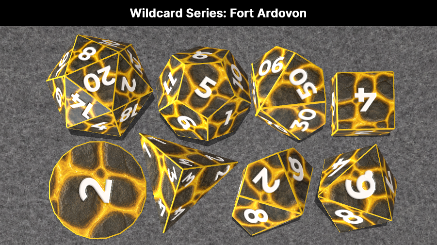</a>
  <a href="images/ws-gabbys-grass.webp"></a>
  <a href="images/ws-san-diego-sunset.webp"></a>
  <a href="images/ws-synthwave.webp"></a>
  <a href="images/ws-vampira.webp"></a>
  <a href="images/ws-winter-is-coming.webp"></a>
</p>

---

## 📜 Licensing & Attribution
This project is licensed under the [Foundry Virtual Tabletop End User License Agreement's Limited License for Package Development](https://foundryvtt.com/article/license/) and maintains the following licenses:

### ⚙️ Code
```
Copyright (c) 2026 mdf (https://github.com/mdf-irl)
Licensed under MIT License (see LICENSE)
```

### ✒️ Fonts
* [Inter](https://fonts.google.com/specimen/Inter)
```
Copyright 2016 The Inter Project Authors (https://github.com/rsms/inter)
Licensed under SIL Open Font License, Version 1.1 (OFL-1.1) (https://openfontlicense.org/)
```
* [Montserrat](https://fonts.google.com/specimen/Montserrat)
```
Copyright 2011 The Montserrat Project Authors (https://github.com/JulietaUla/Montserrat)
Licensed under SIL Open Font License, Version 1.1 (OFL-1.1) (https://openfontlicense.org/)
```
* [New Rocker](https://fonts.google.com/specimen/New+Rocker)
```
Copyright (c) 2012, Pablo Impallari (www.impallari.com|impallari@gmail.com),
Copyright (c) 2012, Brenda Gallo (gbrenda1987@gmail.com),
Copyright (c) 2012, Rodrigo Fuenzalida (www.rfuenzalida.com|hello@rfuenzalida.com),
with Reserved Font Name 'New Rocker'
Licensed under SIL Open Font License, Version 1.1 (OFL-1.1) (https://openfontlicense.org/)
```
### 🜂 Icons
* [Cricket](https://game-icons.net/1x1/delapouite/cricket.html)
* [Dice Fire](https://game-icons.net/1x1/delapouite/dice-fire.html)
* [Health Potion](https://game-icons.net/1x1/delapouite/health-potion.html)
```
Created by Delapouite of game-icons.net
Licensed under CC BY 3.0 (http://creativecommons.org/licenses/by/3.0/)
```
### 📢 Sounds
* bbc-1.mp3, bbc-2.mp3, bbc-3.mp3, bbc-4.mp3, bbc-5.mp3
```
Sound effects obtained from https://www.zapsplat.com
Licensed under ZapSplat Standard License Agreement (https://www.zapsplat.com/license-type/standard-license/)
```
### 🎨 Textures
```
Copyright (c) 2026 mdf (https://github.com/mdf-irl)
Textures from Crispy Critters (https://github.com/mdf-irl/crispy-critters)
Licensed under CC BY-NC-SA 4.0 (https://creativecommons.org/licenses/by-nc-sa/4.0/)
```