<p align="center">
  
</p>

Coming soon...

## 💾 Installation
Install in Foundry VTT via manifest:  
`https://raw.githubusercontent.com/mdf-irl/crispy-critters/master/module.json`

---

## 🎲 Dice Previews (click to enlarge)
<p align="center">
  <a href="images/ss-barbarian.webp"></a>
  <a href="images/ss-bard.webp"></a>
  <a href="images/ss-cleric.webp"></a>
  <a href="images/ss-druid.webp"></a>
</p>

---

## 🎲 Texture Previews (hover for name, click to enlarge)
<p align="center">
  <a href="textures/abyssal-grave.webp">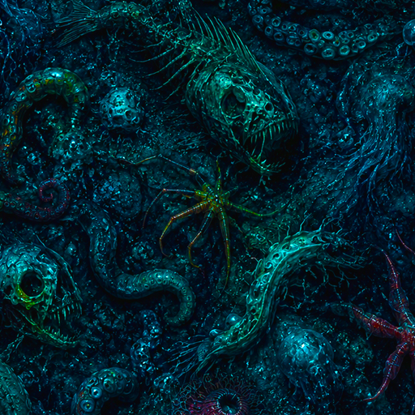</a>
  <a href="textures/astral-ember.webp">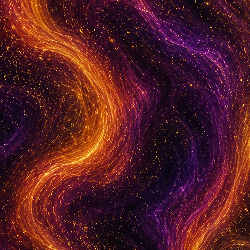</a>
  <a href="textures/astral-radiance.webp">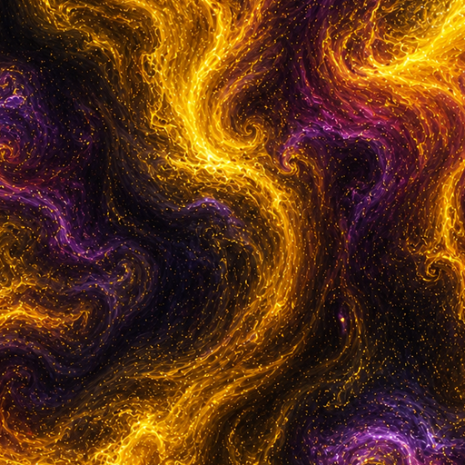</a>
  <a href="textures/astral-solaris.webp">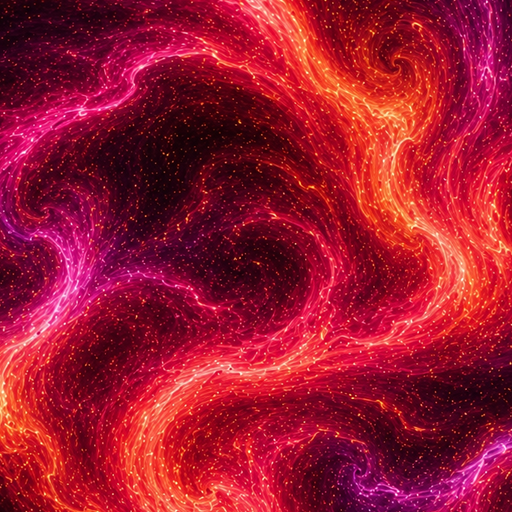</a>
  <a href="textures/astral-tempest.webp">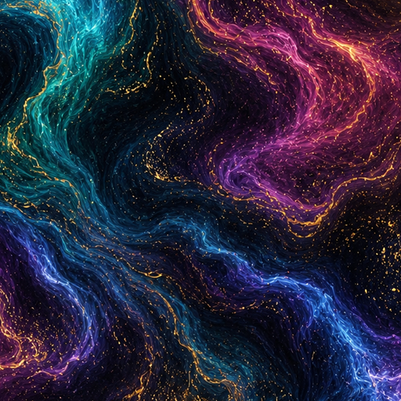</a>
  <a href="textures/astral-tide.webp">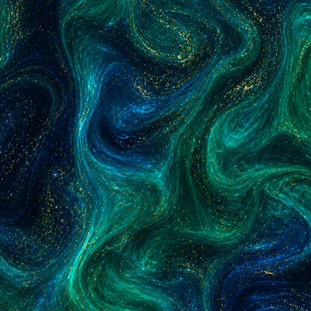</a>
  <a href="textures/bbc.webp">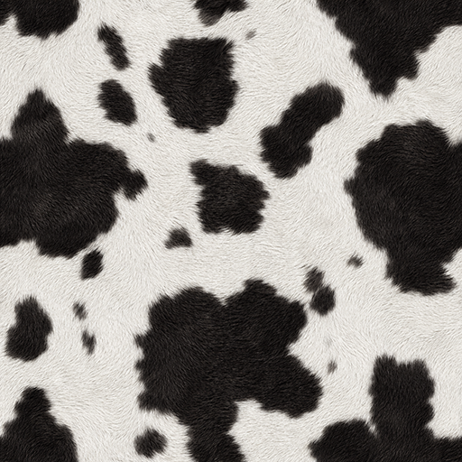</a>
  <a href="textures/candy-hearts.webp"></a>
  <a href="textures/cosmic-chaos.webp"></a>
  <a href="textures/cotton-candy.webp">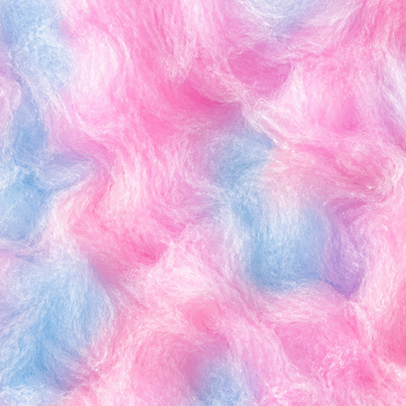</a>
  <a href="textures/dragon-scale.webp">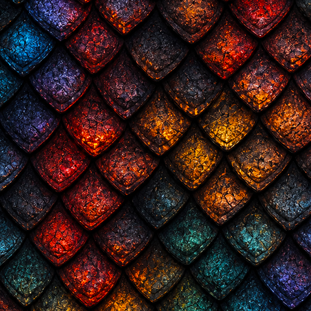</a>
  <a href="textures/eldritch-night.webp">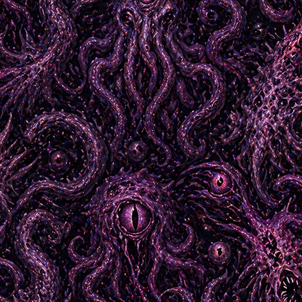</a>
  <a href="textures/gabbys-grass.webp"></a>
  <a href="textures/god-damaged.webp">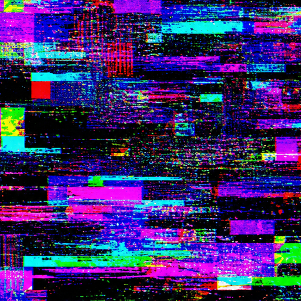</a>
  <a href="textures/hypno-creep.webp"></a>
  <a href="textures/moon.webp">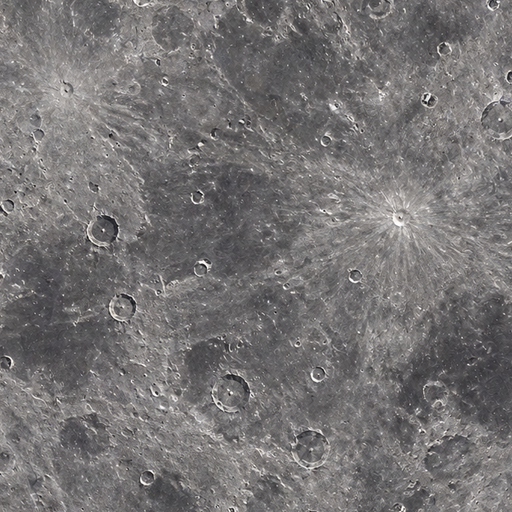</a>
  <a href="textures/nebula.webp"></a>
  <a href="textures/obsidian-ice.webp"></a>
  <a href="textures/obsidian-magma.webp">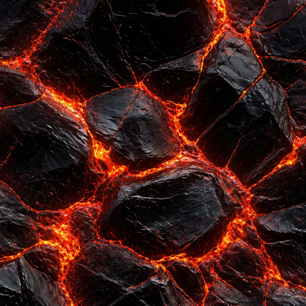</a>
  <a href="textures/obsidian-ooze.webp">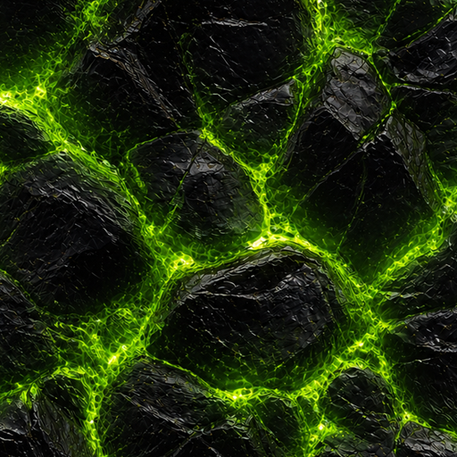</a>
  <a href="textures/party-skulls.webp">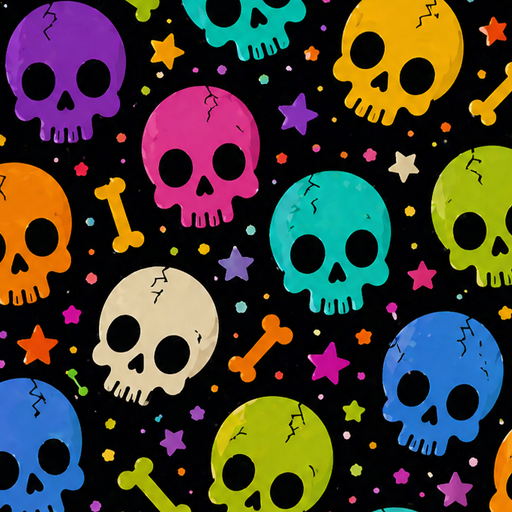</a>
  <a href="textures/pixie-blue.webp">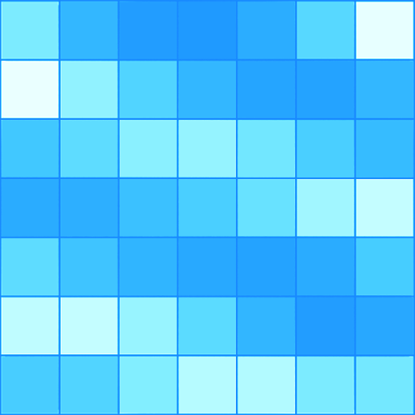</a>
  <a href="textures/pixie-pink.webp">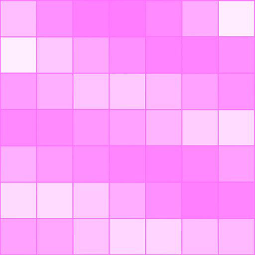</a>
  <a href="textures/san-diego-sunset.webp">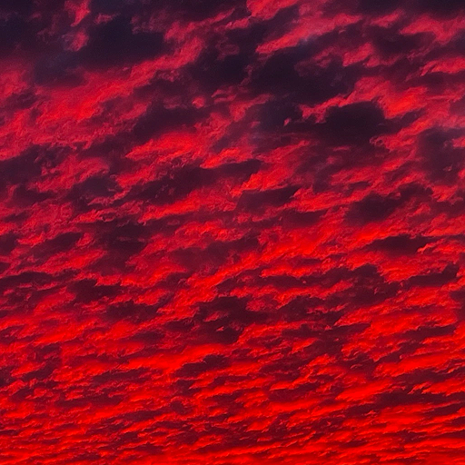</a>
  <a href="textures/space-oddity.webp">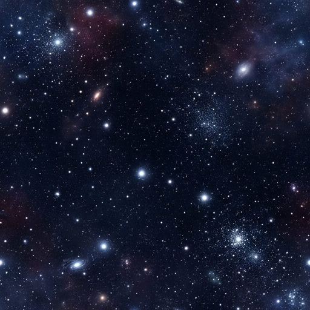</a>
  <a href="textures/spooky-ghosts.webp">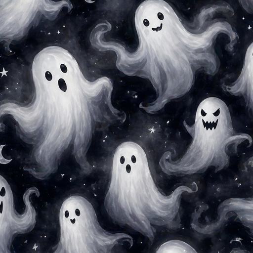</a>
  <a href="textures/sweets.webp"></a>
  <a href="textures/vampira.webp">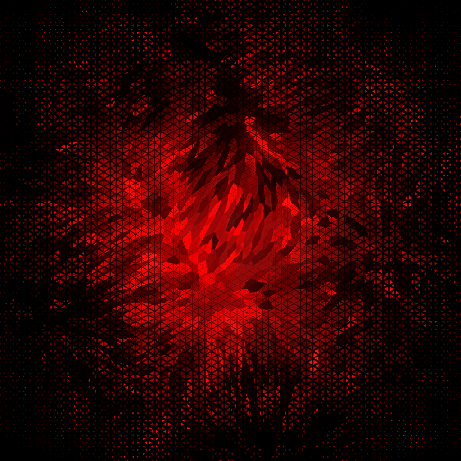</a>
  <a href="textures/winter-is-coming.webp"></a>
  <a href="textures/zombies.webp">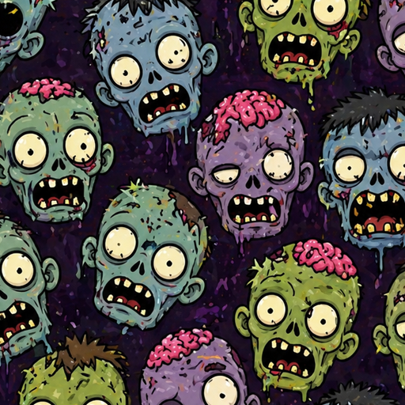</a>
</p>

---

## 📜 Licensing
This project is licensed under the [Foundry Virtual Tabletop End User License Agreement's Limited License for Package Development](https://foundryvtt.com/article/license/) and uses the following licenses:

- **Code:** MIT License (see LICENSE)
- **Textures / Image Assets:** CC BY-NC-SA 4.0 (see LICENSE-TEXTURES)
- **Fonts:** SIL Open Font License 1.1 (see LICENSE-FONTS and individual font folders)

### Important Notes
- Commercial use of textures is **not permitted**
- Use of textures **must be appropriately credited**
- Fonts may have additional requirements (see individual OFL.txt files)

---

## 📎 Attribution
### Fonts
* [Bangers](https://fonts.google.com/specimen/Bangers) (`bangers-v25-latin-regular.woff2`):
```
Copyright 2010 The Bangers Project Authors (https://github.com/googlefonts/bangers)
Licensed under SIL Open Font License, Version 1.1 (OFL-1.1) (https://openfontlicense.org/)
```
* [Creepster](https://fonts.google.com/specimen/Creepster) (`creepster-v13-latin-regular.woff2`):
```
Copyright (c) 2011, Font Diner, Inc (diner@fontdiner.com), with Reserved Font Names "Creepster"
Licensed under SIL Open Font License, Version 1.1 (OFL-1.1) (https://openfontlicense.org/)
```
* [Fredoka](https://fonts.google.com/specimen/Fredoka) (`fredoka-v17-latin-700.woff2`)
```
Copyright 2016 The Fredoka Project Authors (https://github.com/hafontia/Fredoka-One)
Licensed under SIL Open Font License, Version 1.1 (OFL-1.1) (https://openfontlicense.org/)
```
* [New Rocker](https://fonts.google.com/specimen/New+Rocker) (`new-rocker-v17-latin-regular.woff2`):
```
Copyright (c) 2012, Pablo Impallari (www.impallari.com|impallari@gmail.com),  
Copyright (c) 2012, Brenda Gallo (gbrenda1987@gmail.com),  
Copyright (c) 2012, Rodrigo Fuenzalida (www.rfuenzalida.com|hello@rfuenzalida.com),  
with Reserved Font Name 'New Rocker',
Licensed under SIL Open Font License, Version 1.1 (OFL-1.1) (https://openfontlicense.org/)
```
### Textures
```
Copyright (c) 2026 mdf (https://github.com/mdf-irl)
Textures from Crispy Critters (https://github.com/mdf-irl/crispy-critters)
Licensed under CC BY-NC-SA 4.0 (https://creativecommons.org/licenses/by-nc-sa/4.0/)
```
